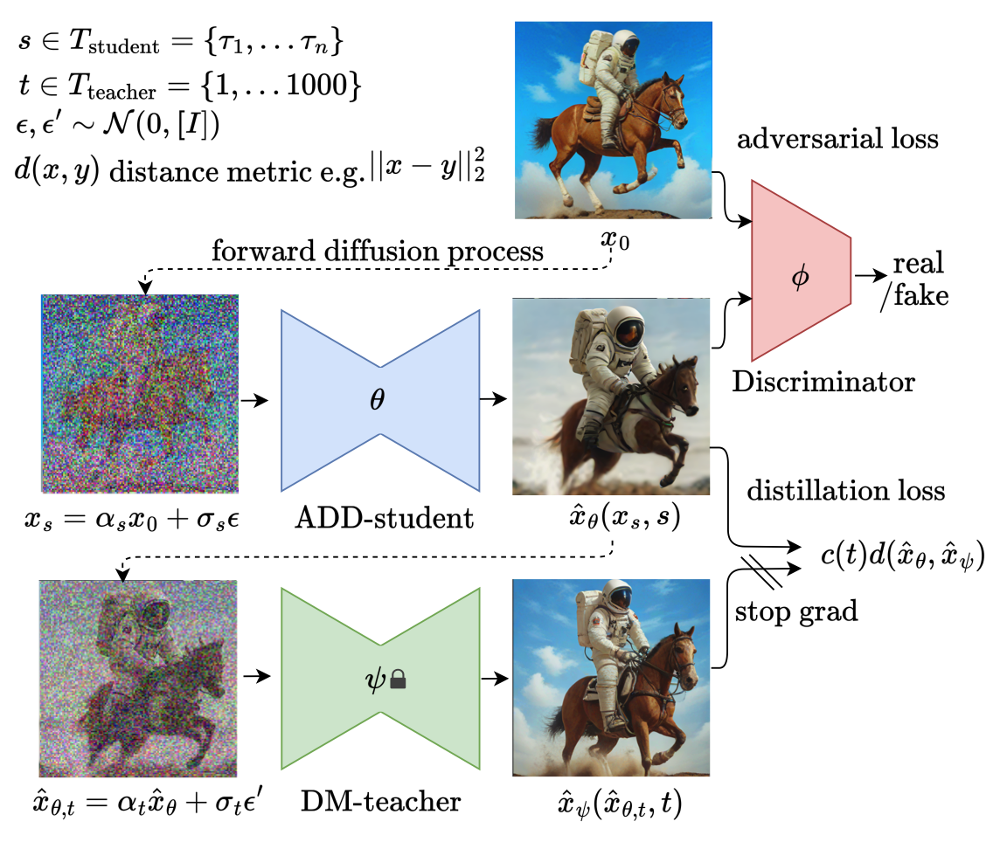

# adversarial-diffusion-distillation
My Implementation of Adversarial Diffusion Distillation https://arxiv.org/pdf/2311.17042.pdf

# Warning
This implementation differs from the original implementation in the paper in following ways:

1. The discriminator is a single prediction head resnet50 initialized from [these weights](https://pytorch.org/vision/main/models/generated/torchvision.models.resnet50.html), but not a ViT conditioned on DINOv2 and CLIP features
